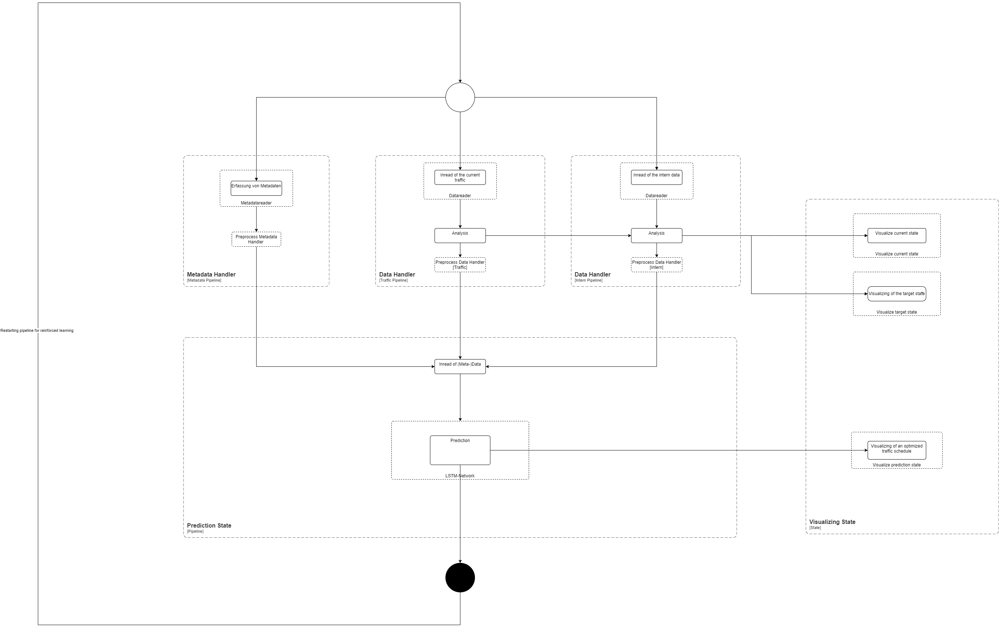

# PlanLOS! Machbarkeitsstudie

## Architektur

Im Folgenden Abbild 1 ist das Sequenzdiagram für die Architektur des LSTM-Netzwerk zu sehen.

Diese besteht aus drei unterschiedlichen Pipelines zum Data-Handling. Die erfassten Daten (Metadaten, Traffic und Intern) werden jeweils im JSON-Format erfasst und weiter verarbeitet.

Exemplarisch ist im Folgenden das JSON-Format für die Metadaten dargestellt.

Die internen Datensätze der Verkehrsbetreiber so wie des Verkehrsaufkommen befinden sich in einem ähnlichen JSON-Format. Nur die entsprechende Keys und Werte variieren.

Innerhalb der Pipeline für den Data-Handler wird, neben dem Preprocessing der Datensätze für die Vorhersage, auch eine Analyse der internen und traffic Daten durchgeführt. Diese werden an den Visualisierungsstate übergeben und eine detaillierte Auswertung des bestehenden und des geplanten Verkehrsplan dem Unternehmen zu ermöglichen. 

## Output

