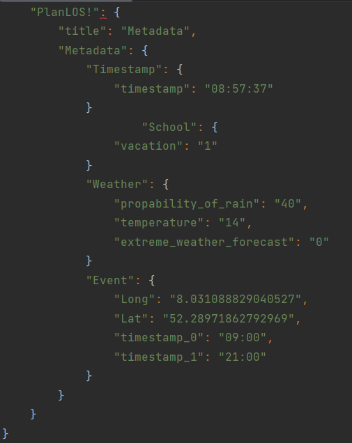

# PlanLOS! Machbarkeitsstudie
Diese ReadME beinhaltet weiterführende Informationen und technische Details zu der Realisierung der KI-gestützten automatisierten und dynamischen Nahverkehrsplanung von PlanLOS!.  

## Architektur

Im Folgenden Abbild 1 ist das Sequenzdiagram für die Architektur der Datapipelines und des Recurrent Neural Networks zu sehen.

Diese besteht aus drei unterschiedlichen Pipelines zum Data-Handling. Die Daten der öffentlichen Verkehrsunternehmen werden im GTFS-Format an PlanLOS! weitergeben. Dieses Format besteht aus 6 bis 15 CSV Dateien mit .txt Endungen, die in einem zip-Archiv zusammengefasst werden. Um für PlanLOS! einen einheitlichen Umgang mit den Daten zu gewährleisten werden diese im Preprocessing in ein JSON-Format umgewandelt.

Ebenfalls werden die Meta- und Trafficdaten in der entsprechenden Pipeline in das JSON-Format überführt. Da die Keys und Values der entsprechenden Daten im JSON-Format variieren, werden unterschiedliche Methoden zum Einlesen der Daten in den Prediction State benötigt. Aber da sich die Daten im gleichen Format befinden, wird garantiert, dass über minimale Änderungen der Methoden zum Einlesen ein permanenter Datenstrom in das neuronale Netz gewährleistet wird.   

Innerhalb der Pipeline für den Data-Handler wird, neben dem Preprocessing der Datensätze für die Vorhersage, auch eine Analyse der internen und traffic Daten durchgeführt. Diese werden an den Visualisierungsstate übergeben und eine detaillierte Auswertung des bestehenden und des geplanten Verkehrsplan dem Unternehmen zu ermöglichen. 

Exemplarisch ist im Folgenden das JSON-Format für die Metadaten dargestellt. 

## Das neuronale Netz

Zur Modellierung eines optimierten Routenplans beschränkt sich PlanLOS! auf eine KI-gestützte Analyse. Dabei wird das Netz mit den Daten aus den entsprechenden Pipelines trainiert. Um dem dynamischen Verhalten des Straßenverkehrs zu entsprechen, nutzt PlanLOS! RNN's (Recurrent Neural Networks). Diese ermöglichen ein continous-learning. Das bedeutet, dass nach dem einmaligen Durchlaufen der Pipelines und Generierung eines entsprechend verbesserten Models, ein erneuter Loop mit den neuen Datensätzen gestartet wird. Nach der erneuten KI-gestützen Modellierung wird überprüft, ob das alte Modell noch aktuell für den jeweiligen Verkehr ist. Sollte dies nicht der Fall sein, wird dieses Modell von dem neuen ersetzt. Ansonsten bleibt das alte Modell bestehen. Dies wird in einem Eternal-Loop durchgeführt. So ermöglichen wir dem öffentlichen Nahverkehr dynamisch, auf Grund der aktuelle Datenlage, die Routenplanung auf externe Gegebenheiten anzupassen.  

## Output

PlanLOS! bietet seinen Kunden zwei unterschiedliche Oberflächen. Eine graphische Oberfläche für Unternehmen und eine für die Endkunden. 

### Unternehmen

Die Oberfläche für das Unternehmen bietet eine detaillierte Einsicht in die aktuelle Datenlage und Routenpläne. Dazu gehören die im Routenplan berücksichtigten Daten, der aktuelle Routenplan, die aktuellen Abfahrts- und Ankunftszeiten, so wie die zeitliche Abweichungen des realisierten Plans von dem Erwarteten. Zusätzlich wird der neu generierte Routenplan, die erwarteten Ankunfts und Abfahrtszeiten und ein Indikator für die Verbesserung des Routenplans angezeigt. Auf diese Weise garantiert PlanLOS! Transparenz gegenüber seinen Kunden immer den bestmöglichen Routenplan zur Verfügung zu stellen. 

### Endverbraucher

Die Ansicht für den Endkunden bietet nicht so viele Details, wie die des Unternehmen. Hier beschränkt sich PlanLOS! auf die relevanten Daten für den Endkunden. Der aktuelle Routenplan mit integrierten Ankunfts- und Abfahrtszeiten, der zukünftige Routenplan mit den entsprechenden Zeiten und eine detaillierte aktuelle Ansicht der zu erwartenden Wahrscheinlichkeiten mit der sich der Bus verspätet. 

## PlanLOS! bietet Ihnen eine dynamische, KI-gestütze Komplettlösung für die Öffentlichen Nahverkehrsunternehmen und Ihre Endverbraucher! 

## Bei Interesse melden Sie sich gerne unter planlosunternehmen@gmail.com.

## Wir freuen uns auf Ihre Anfrage!
